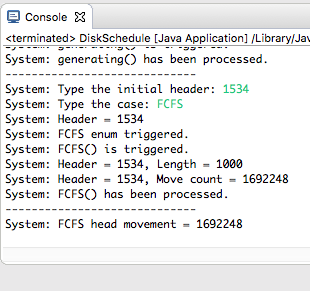
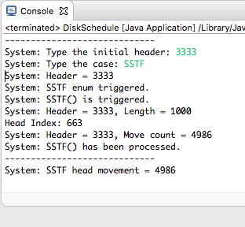
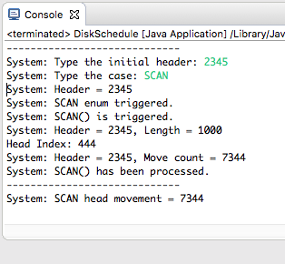

### *Name: Chanyu C., Abraham L., Stephen S., Hydeia B., Jasmin H.*

### Class Name: Computer Science - Operating Systems Class
### Program Name: Disk Scheduling Algorithm Group Project

### Description: 
``` 
This program has three disk scheduling algorithms.

Disk Scheduling is done by an Operating Systems and
each I/O will be processed in a disk.

- 5,000 Disk cylinders from 0 - 4999
- 1,000 Randomly generated cylinder requests

FCFS - Any requests comes in first will be placed in first queue.
This algorithm is very inefficient and requires a lot of
Disk header movement.

SSTF - Closest one from the header will be visited first.
This algorithm is very efficient, because it has the least
amount of Disk header movement.

SCAN - Comparing Header and previous header, it sets the direction
based on it. It's usually efficient, but the results may vary,
because it goes only one direction and it has to reach either
the very top or the bottom to change directions.
```

### Pictures:
#### FCFS (First Come First Serve):
<a href = "PICS/PICS1.png">

#### SSTF (Shortest Seek Time First):
<a href = "PICS/PICS2.png">

#### SCAN (Elevator Algorithm):
<a href = "PICS/PICS3.png">

### Assignment:

```
This homework is due on Friday, December 6, 2019 

This is a group assignment. This work will submitted via a GitHub. 
To submit your work, email me a link to your GitHub repository. 
Make sure you cc your group members so that they know of your submission.
NO late work will be accepted.

Write a program that implements the following disk-scheduling algorithms:
- FCFS
- SSTF
- SCAN

Your program will service a disk with 5000 cylinders numbered 0 to 4999. 
The program will generate a random series of 1,000 cylinder requests 
and service them according to each of nth algorithms listed above. 
The program will be passed the initial position of the disk head 
and report the total amount of head movement required by the algorithm.
```